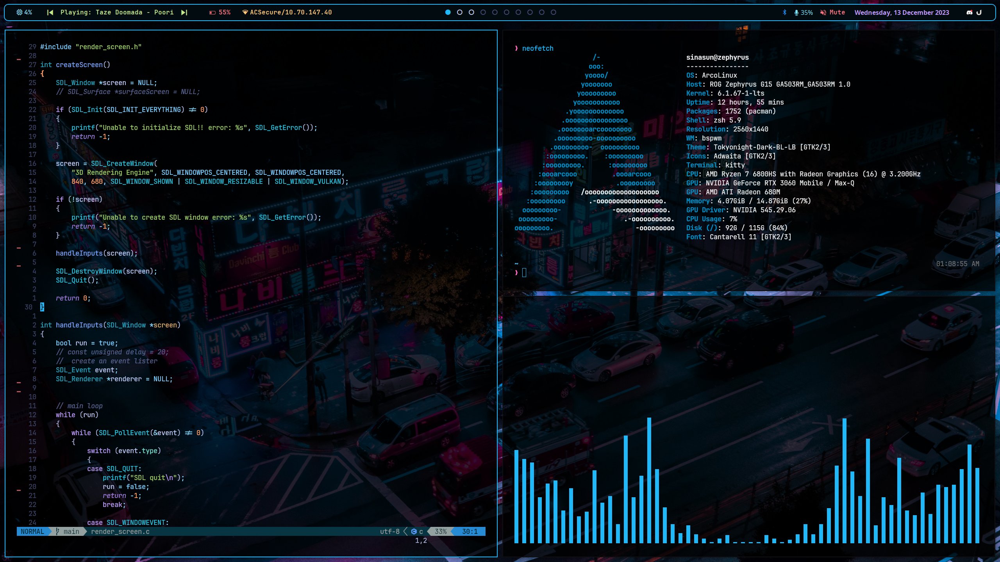

# Dotfiles for Arch Linux BSPWM

These are my personal dotfiles for configuring Arch Linux with the BSPWM window manager.

Feel free to use and customize them to fit your own preferences and workflow.
